### MEETME 

 

**MeetMe is a mobile application that provides an environment for people to talk about their common interests, thoughts and to share their feelings.** 

- When you open the application, first login screen welocmes you.
- You need to register via email to use the application.

 

**REGISTIRATION**

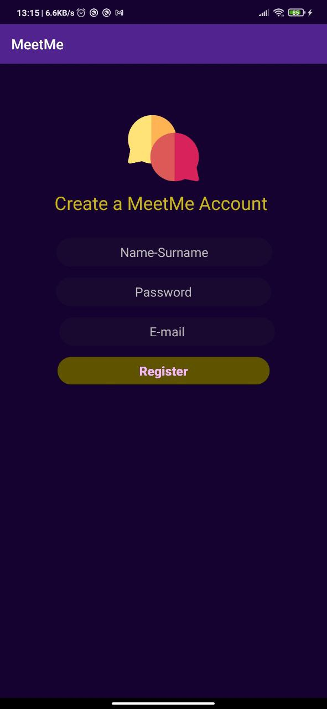
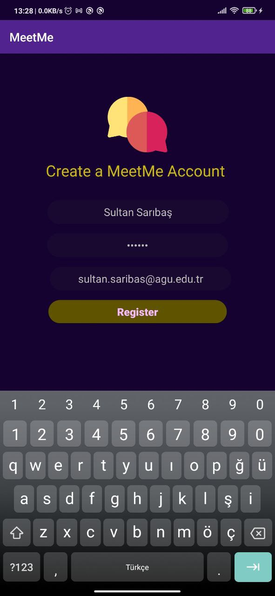
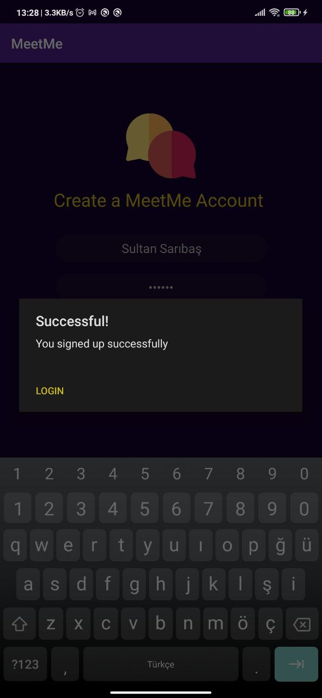

  

**LOGIN**

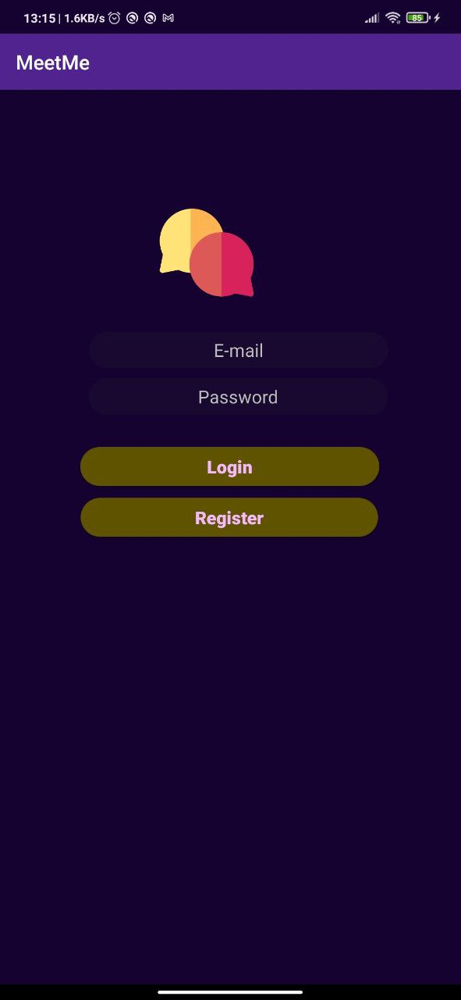
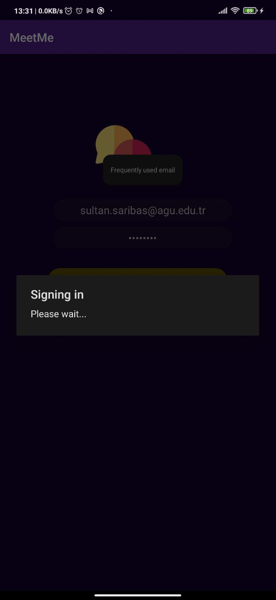 

  

**HOME SCREEN**
- When you login MeetMe, Categories(Home Screen) will show up.

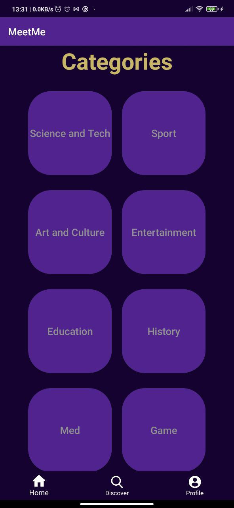  

  

**USER PROFILE**

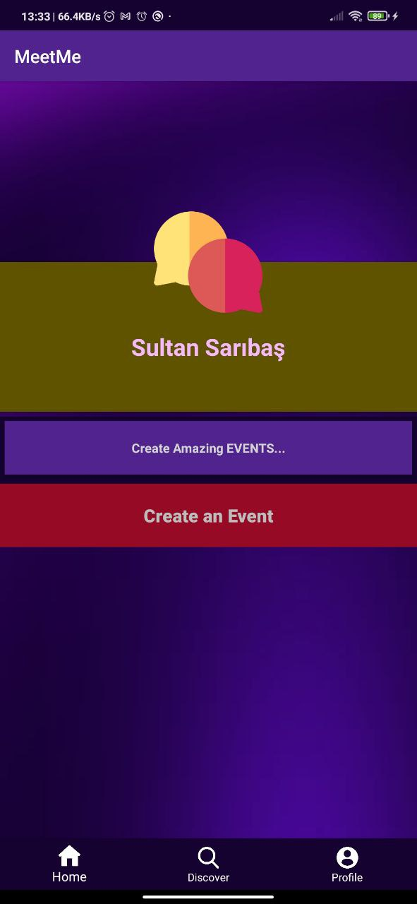 

  

**CREATING AN EVENT**

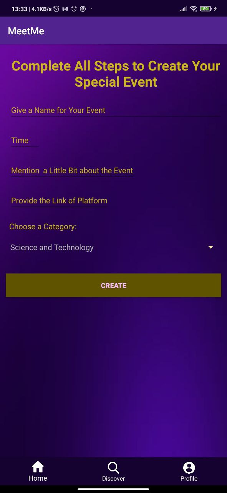
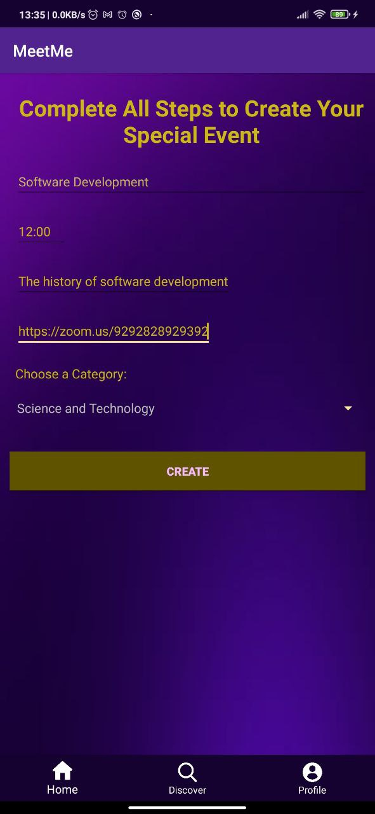

  

**DISCOVER SCREEN**
- You can see the event that you created from Discover Screen.

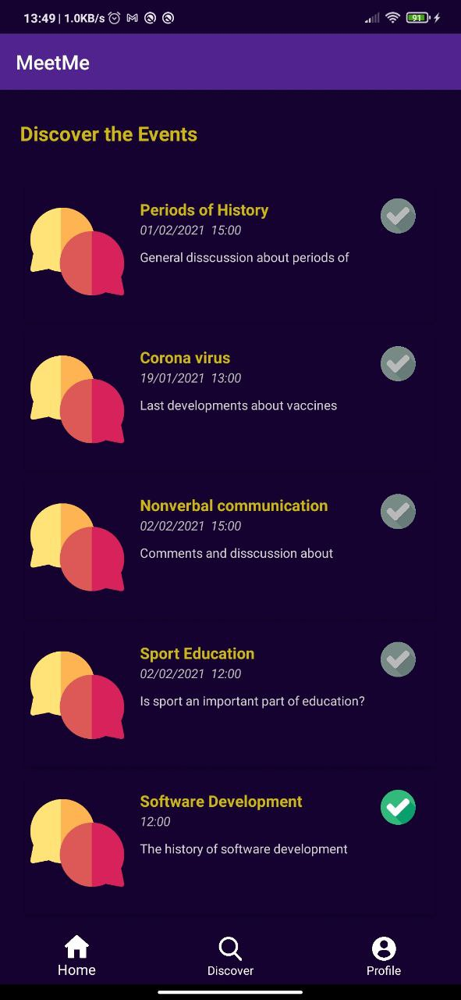 

  

**HOME/CATEGORIES**
- Or from Home Screen Categories → Science and Technology (The Category that you choose for your event).

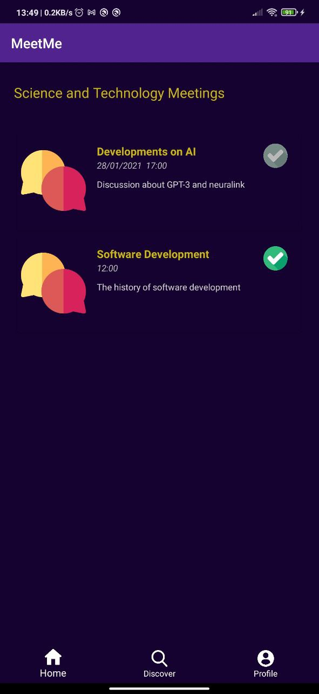 

  

**EVENT DETAIL**

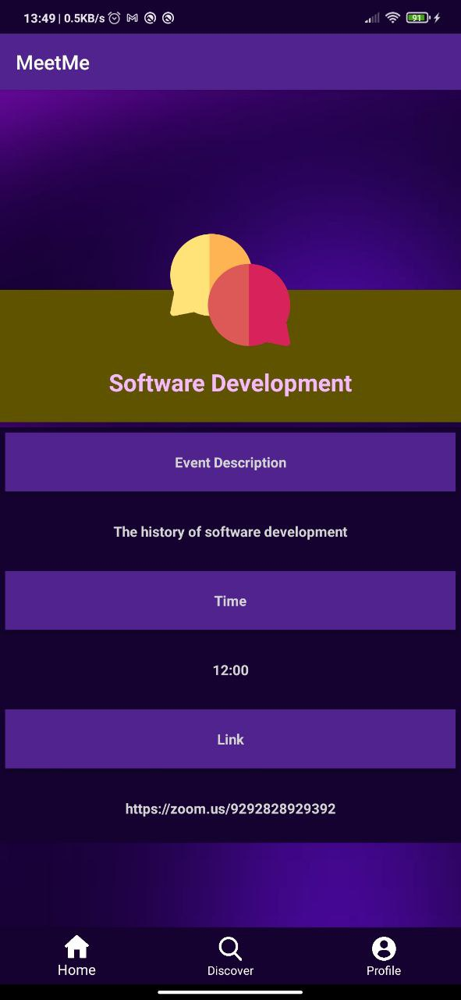